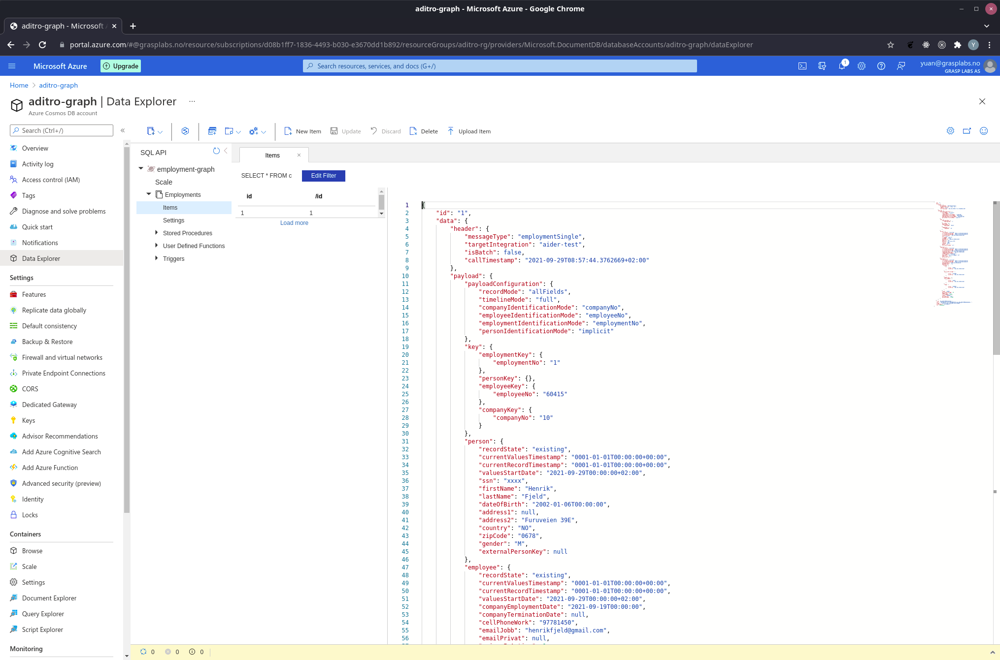

# Cosmosdb Deployment in Azure

## Prerequisites

1. Azure Subscription
2. Terraform locally installed.
3. Requires the use of [direnv](https://direnv.net/).

### Install the required tooling

This document assumes one is running a current version of Ubuntu. Windows users can install the Ubuntu Terminal from the Microsoft Store. The Ubuntu Terminal enables Linux command-line utilities, including bash that will be useful for the following deployment. _Note: You will need the Windows Subsystem for Linux installed to use the Ubuntu Terminal on Windows_.

Currently the versions in use are [Terraform 0.14.5](https://releases.hashicorp.com/terraform/0.14.5/).

> Note: Terraform and Go are recommended to be installed using a [Terraform Version Manager](https://github.com/tfutils/tfenv)


### Install the Azure CLI

For information specific to your operating system, see the [Azure CLI install guide](https://docs.microsoft.com/en-us/cli/azure/install-azure-cli?view=azure-cli-latest). You can also use the single command install if running on a Unix based machine.

```bash
curl -sL https://aka.ms/InstallAzureCLIDeb | sudo bash

# Login to Azure CLI and ensure subscription is set to desired subscription
az login
az account set --subscription <your_subscription>
```

## Provision the Resources
> [Role Documentation](https://docs.microsoft.com/en-us/azure/role-based-access-control/rbac-and-directory-admin-roles): Provisioning Common Resources requires owner access to the subscription.

The script `prepare.sh` script is a _helper_ script designed to help setup some of the common things that are necessary for infrastructure.

- Ensure you are logged into the azure cli with the desired subscription set.
- Ensure you have the access to run az ad commands.

```bash
# Execute Script
export UNIQUE=demo

./infra/scripts/prepare.sh $(az account show --query id -otsv) $UNIQUE
```

After running the script, the `.envrc` will be looking like:

```bash
# OSDU ENVIRONMENT demo
# ------------------------------------------------------------------------------------------------------
export RANDOM_NUMBER=
export UNIQUE=""
export COMMON_VAULT=""
export ARM_TENANT_ID=""
export ARM_ACCESS_KEY=""
export TF_VAR_remote_state_account=""
export TF_VAR_remote_state_container=""
export TF_VAR_resource_group_location=""
export TF_VAR_cosmosdb_replica_location=""
```

Navigate to `provisioning` folder and execute the following commeands to deploy the required resources.


```bash
# This configures terraform to leverage a remote backend that will help you and your
# team keep consistent state
terraform init -backend-config "storage_account_name=${TF_VAR_remote_state_account}" -backend-config "container_name=${TF_VAR_remote_state_container}"

# See what terraform will try to deploy without actually deploying
terraform plan

# Execute a deployment
terraform apply
```

Optionally execute the following command to delete resources.

```bash
# Destroy resources and tear down deployment. Only do this if you want to destroy your deployment.
terraform destroy
```

If everything runs oki, the cosmosdb and all related resources could be found in azure resource group under the subscription and ready to be consumed.



## Acknowledgments

Portions for this work are from:

* https://github.com/microsoft/terraform-provider-azuredevops
* https://github.com/microsoft/azureml-terraform-examples
* https://github.com/microsoft/azure-cli
* https://github.com/hashicorp/terraform-provider-azurerm